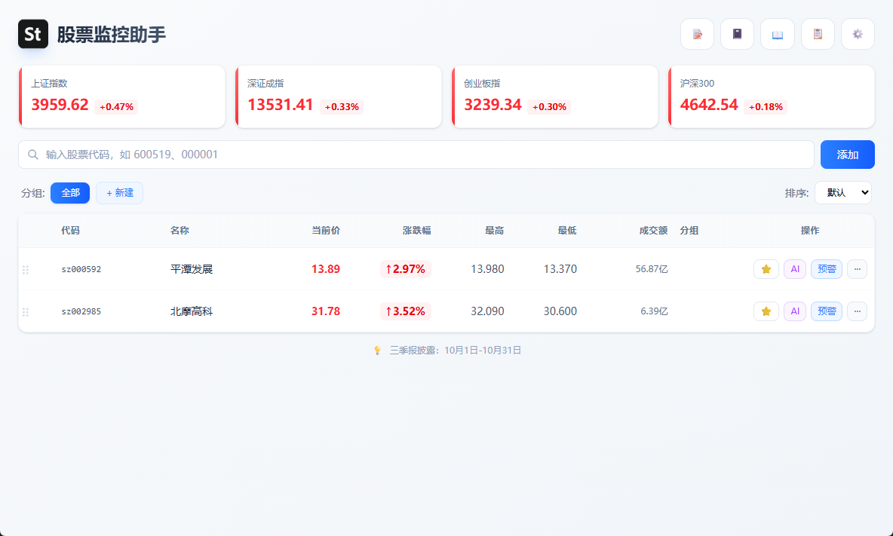
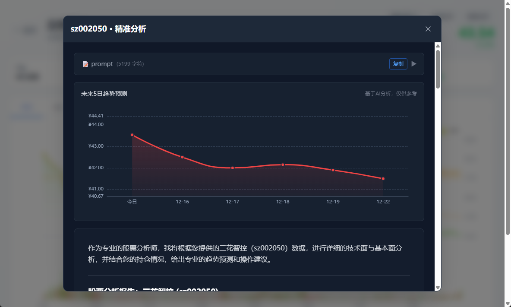
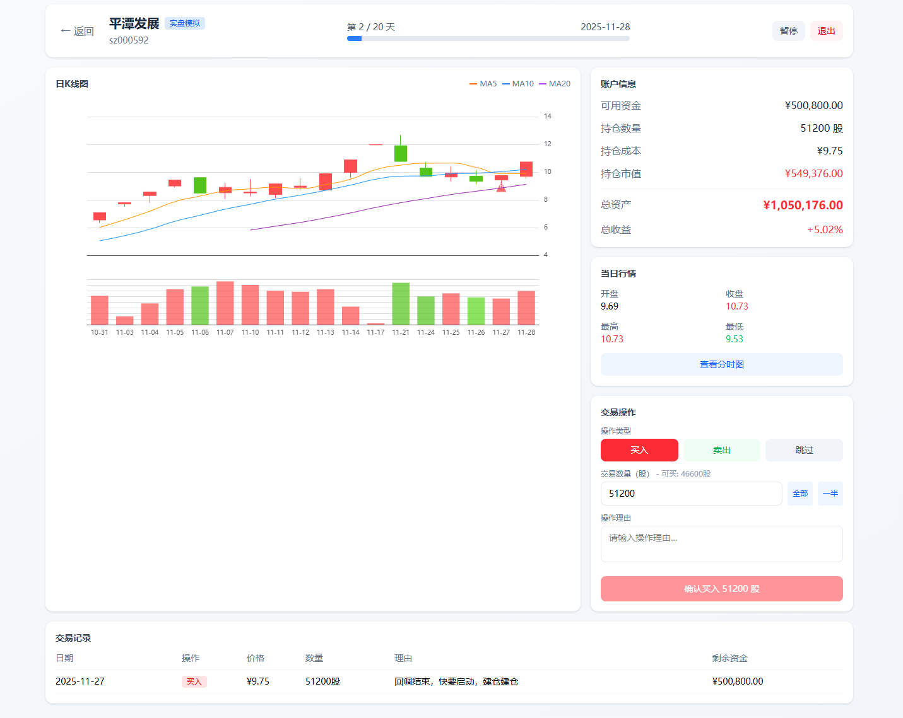
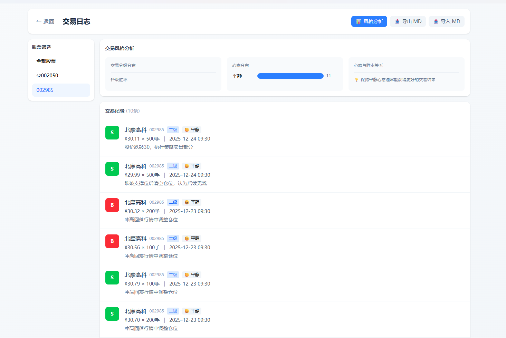
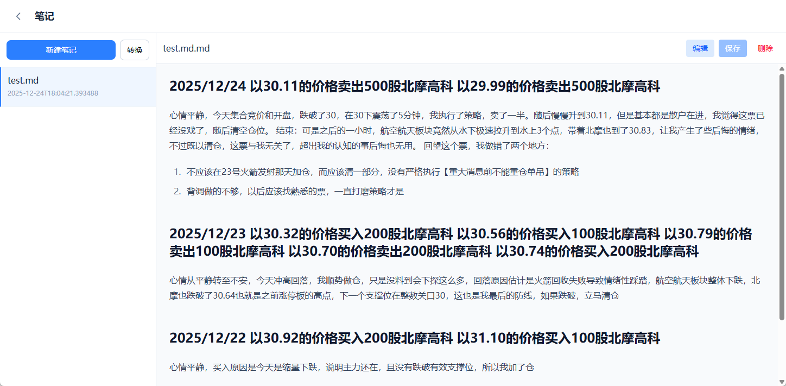

<picture>
  
</picture>

<div align="center">

# Stock Monitor

A cross-platform desktop stock monitoring application with real-time quotes, AI-powered analysis, alerts, and floating window.

English | [简体中文](./README.zh-CN.md)

<p>
  
  
  
  
</p>

<p>
  
  
</p>

</div>

> **Disclaimer**: This software is for learning and communication purposes only and does not constitute any investment advice. AI analysis results and trend predictions are for reference only and accuracy is not guaranteed. The stock market is risky, invest with caution. Any profits or losses from using this software are borne by the user and are not related to the developer.

## Table of Contents

- [News](#news)
- [Features](#features)
- [Screenshots](#screenshots)
- [Quick Start](#quick-start)
- [Tech Stack](#tech-stack)
- [Project Structure](#project-structure)
- [Configuration](#configuration)
- [License](#license)

## News

- **[2025-12-24]** 🎉 V1.2.0 Released! New note-taking feature with Markdown support, auto-save, and AI-powered trade record extraction.
- **[2025-12-22]** 🚀 V1.1.0 Released! Paper trading simulation based on historical K-line data, trade log page, and trading style analysis.
- **[2025-12-15]** ✨ V1.0.3 Released! Trade record feature, K-line chart markers, AI structured output with signal extraction.
- **[2025-12-12]** 📊 V1.0.2 Released! Index intraday chart, AI prompt display, config import/export.
- **[2025-12-10]** 🎊 V1.0.0 Initial Release! Real-time quotes, alerts, floating window, stock details.

## Features

### 📈 Real-time Monitoring
- Real-time A-share market data (price, change%, volume, etc.)
- Major index display (SSE, SZSE, ChiNext, CSI 300)
- Stock grouping and drag-and-drop sorting
- Desktop floating window for focused stocks

### 🤖 AI-Powered Analysis
- Multi-model support: GPT / Claude / Gemini / DeepSeek / Kimi / Qwen / Doubao / GLM
- Quick analysis: Fast judgment based on daily data
- Precise analysis: Multi-dimensional analysis including technicals, fundamentals, capital flow
- Trend prediction: AI predicts price movement for next 5 trading days
- Structured output: Auto-extract bullish/cautious/bearish signals

### 📝 Trade Records & Notes
- Record buy/sell/T+0 operations with reasons
- K-line chart markers showing historical trade points
- AI analysis history with signal tracking
- Auto-calculate position cost and quantity
- Markdown notes with auto-save
- AI-powered trade record extraction from notes

### 🎮 Paper Trading Simulation
- Practice trading with historical data
- Customizable simulation days (7-50) and initial capital
- Time rewind: K-line only shows up to current simulation date
- View intraday chart for decision support
- AI scoring and evaluation after completion

### 🔔 Alert System
- Take-profit / Stop-loss price alerts
- Price change percentage alerts
- Push notifications via PushPlus (WeChat) and DingTalk

## Screenshots

<table>
  <tr>
    <td align="center"><b>Stock Details</b></td>
    <td align="center"><b>AI Prediction</b></td>
  </tr>
  <tr>
    <td></td>
    <td></td>
  </tr>
  <tr>
    <td align="center"><b>Paper Trading</b></td>
    <td align="center"><b>Trade History</b></td>
  </tr>
  <tr>
    <td></td>
    <td></td>
  </tr>
  <tr>
    <td align="center"><b>Trade Log</b></td>
    <td align="center"><b>Notes</b></td>
  </tr>
  <tr>
    <td></td>
    <td></td>
  </tr>
</table>

## Quick Start

### Prerequisites

- Node.js >= 18
- Python >= 3.9

### Installation

```bash
# Clone the repository
git clone https://github.com/your-username/stock-monitor.git
cd stock-monitor

# Install backend dependencies
cd backend
pip install -r requirements.txt

# Install frontend dependencies
cd ../frontend
npm install
```

### Running

```bash
# Terminal 1: Start backend
cd backend
python main.py

# Terminal 2: Start frontend
cd frontend
npm run dev
```

### Building

```bash
# Windows
npm run build:win

# macOS
npm run build:mac

# Linux
npm run build:linux
```

## Tech Stack

| Layer | Technology |
|-------|------------|
| Frontend | Electron + Vue 3 + TypeScript + TailwindCSS + ECharts |
| Backend | Python + FastAPI |
| Data Source | Sina Finance, East Money |

## Project Structure

```
stock-monitor/
├── backend/                # Python Backend
│   ├── api/               # API routes
│   ├── domain/            # Business logic
│   ├── services/          # Service layer
│   ├── providers/         # AI providers
│   ├── repositories/      # Data storage
│   ├── schemas/           # Data models
│   ├── core/              # Core config
│   └── main.py            # Entry point
├── frontend/              # Electron + Vue Frontend
│   ├── electron/          # Electron main process
│   └── src/               # Vue source code
├── docs/                  # Documentation
└── scripts/               # Build scripts
```

## Configuration

### Adding Stocks

Enter stock code in the following formats:
- Numbers only: `600519` (auto-detect SH/SZ)
- With prefix: `sh600519`, `sz000001`

### AI Configuration

Configure in Settings page:
- Select model provider
- Enter API Key
- Optional: Configure proxy

### Push Notifications

- **PushPlus**: Get token at [pushplus.plus](https://www.pushplus.plus/)
- **DingTalk**: Create group bot to get webhook URL

## License

[MIT License](LICENSE)

---

<div align="center">
  <sub>Built with ❤️ for A-share investors</sub>
</div>
