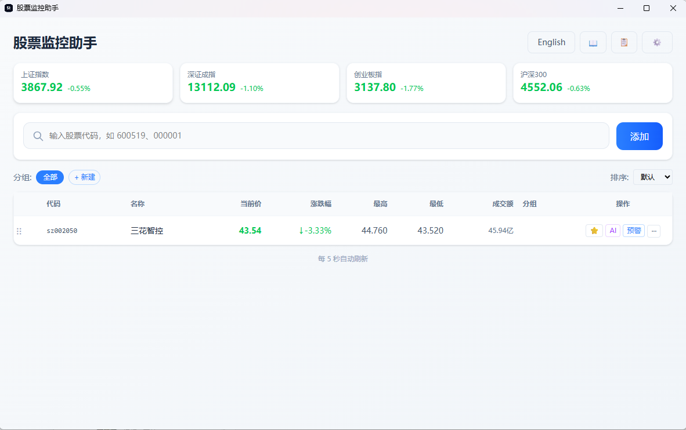
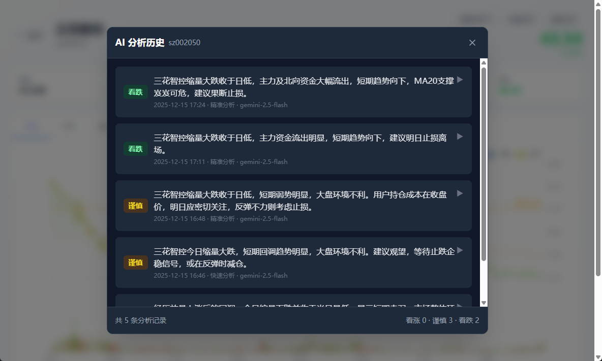

# 股票监控助手

> **免责声明**：本软件仅供学习交流使用，不构成任何投资建议。AI 分析结果和趋势预测仅供参考，不保证准确性。股市有风险，投资需谨慎，使用本软件产生的任何盈亏均由用户自行承担，与开发者无关。

一个跨平台的桌面股票监控应用，支持实时行情、AI 智能分析、预警推送和桌面悬浮窗。



## 功能特性

### 行情监控

- 实时获取 A 股行情数据（价格、涨跌幅、成交量等）
- 大盘指数展示（上证、深证、创业板、沪深300）
- 股票分组管理和拖拽排序
- 桌面悬浮窗，始终置顶显示重点关注股票

### 股票详情

- 分时走势图和 K 线图
- 资金流向分析（主力、散户）
- 技术指标（换手率、量比、振幅、均线）
- 基本面数据（PE、PB、市值、行业）


### AI 智能分析

- 支持 Gemini / GPT / Claude 多模型
- 快速分析：基于当日数据快速判断
- 精准分析：综合技术面、基本面、资金流向、北向资金、融资融券等多维度数据
- 趋势预测：AI 预测未来 5 个交易日价格走势
- 结构化输出：自动提取看涨/谨慎/看跌信号


### 复盘记录

- 交易记录：记录买入/卖出/做T 操作及原因
- K 线图标记：直观展示历史操作点位
- AI 分析历史：查看历史分析记录和信号
- 自动计算持仓成本和数量



### 实盘模拟

- 基于历史数据进行模拟交易练习
- 自定义模拟天数（7-50天）和初始资金
- 时间回溯：K线图只显示到当前模拟日期
- 交易操作：买入/卖出/跳过，需填写操作理由
- 分时图查看：可查看当日分时图辅助决策
- AI 智能评分：模拟结束后 AI 综合评价交易表现
- 记录管理：支持暂停/继续/查看历史模拟记录

### 预警推送

- 止盈/止损价格预警
- 涨跌幅异动提醒
- 支持 PushPlus（微信）和钉钉机器人推送

### 其他

- 系统托盘，最小化后台运行
- 配置导入导出，轻松备份迁移
- 代理配置，解决国内访问 AI 服务问题

## 技术栈

- 前端：Electron + Vue 3 + TypeScript + TailwindCSS + ECharts
- 后端：Python + FastAPI
- 数据源：新浪财经、东方财富

## 安装与运行

### 环境要求

- Node.js >= 18
- Python >= 3.9

### 快速开始

```bash
# 克隆项目
git clone https://github.com/your-username/stock-price-monitor.git
cd stock-price-monitor

# 安装后端依赖
cd backend
pip install -r requirements.txt

# 安装前端依赖
cd ../frontend
npm install
```

### 启动应用

启动后端服务：

```bash
cd backend
python main.py
```

启动前端应用：

```bash
cd frontend
npm run dev
```

### 打包发布

```bash
# Windows
npm run build:win

# macOS
npm run build:mac

# Linux
npm run build:linux
```

## 使用说明

### 添加股票

输入股票代码，支持以下格式：

- 纯数字：`600519`（自动识别沪深）
- 带前缀：`sh600519`、`sz000001`

### 设置预警

点击股票行的预警按钮，可设置：

- 止盈价格：当前价 >= 设定值时触发
- 止损价格：当前价 <= 设定值时触发
- 涨跌幅预警：涨跌幅绝对值 >= 设定值时触发

### AI 分析配置

在设置页面配置 AI 服务：

- 选择模型提供商（Gemini / GPT / Claude）
- 填入 API Key
- 可选配置代理地址

### 消息推送

- PushPlus Token：在 [pushplus.plus](https://www.pushplus.plus/) 获取
- 钉钉 Webhook：创建钉钉群机器人获取

## 项目结构

```text
stock-price-monitor/
├── backend/                # Python 后端
│   ├── main.py            # FastAPI 入口
│   ├── monitor.py         # 股票监控核心
│   ├── ai_service.py      # AI 分析服务
│   ├── records.py         # 交易记录管理
│   ├── simulation.py      # 实盘模拟管理
│   └── data/              # 本地数据存储
├── frontend/              # Electron + Vue 前端
│   ├── electron/          # Electron 主进程
│   └── src/               # Vue 源码
├── scripts/               # 构建脚本
└── README.md
```

## 数据存储

应用数据存储在以下位置：

- Windows: `%APPDATA%/stock-monitor/data/`
- macOS/Linux: `~/.stock-monitor/data/`

包含文件：

- `stocks.json` - 股票列表和分组
- `settings.json` - 应用设置
- `alerts.json` - 预警配置
- `records.json` - 交易记录和 AI 分析历史
- `simulations.json` - 实盘模拟记录

## License

MIT License

## 贡献

欢迎提交 Issue 和 Pull Request！
